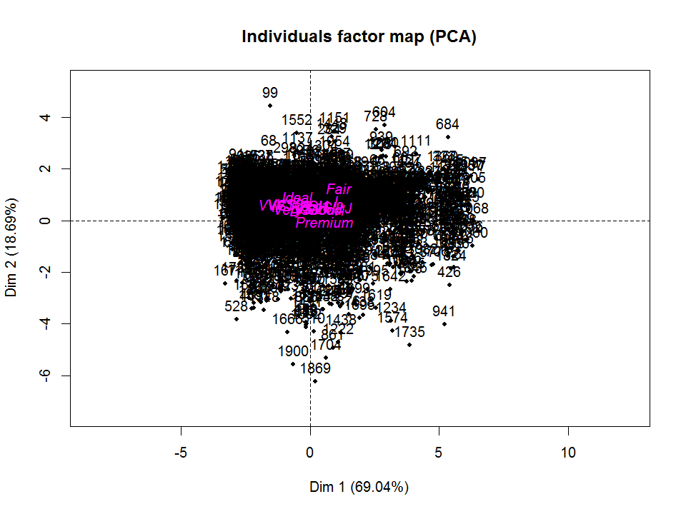
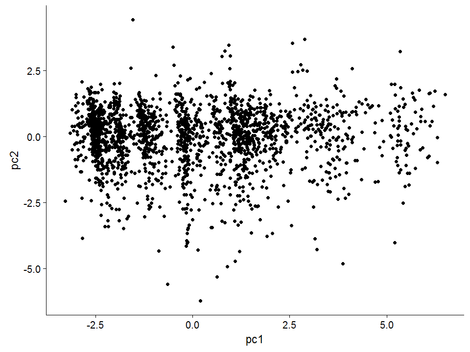
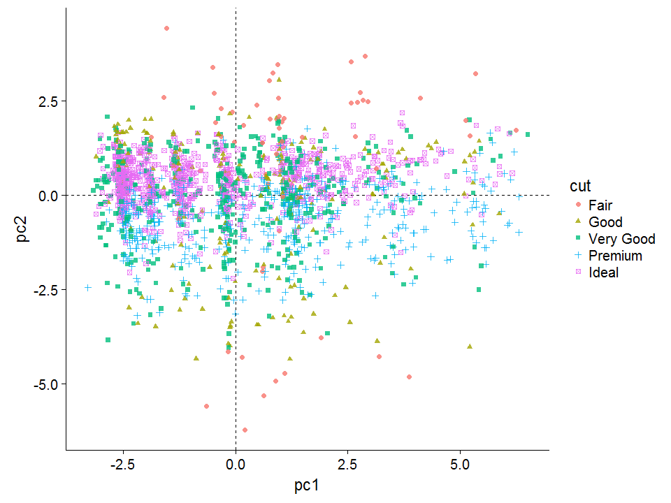
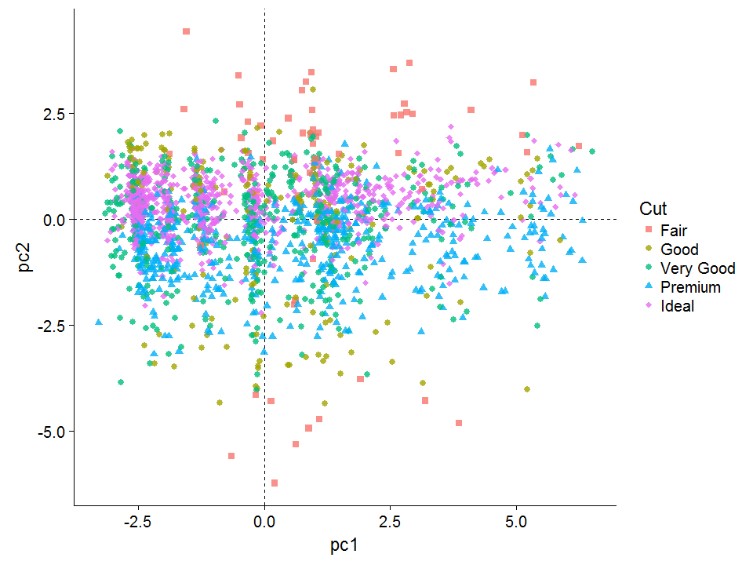
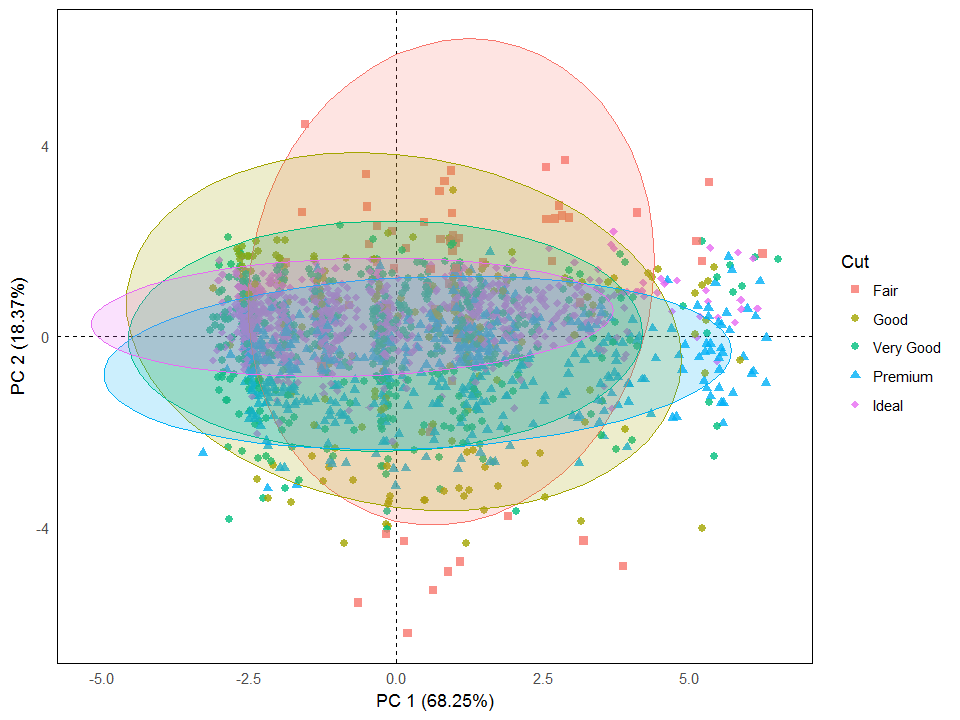
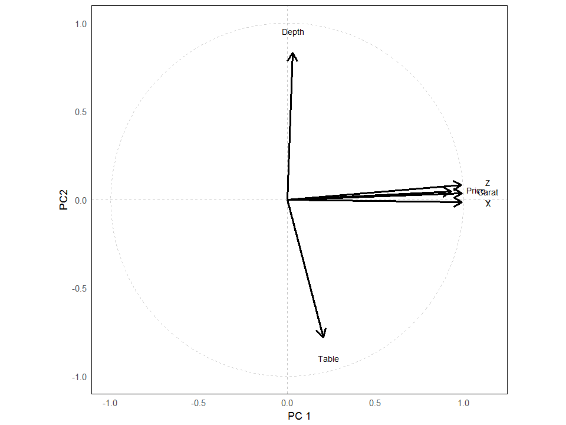
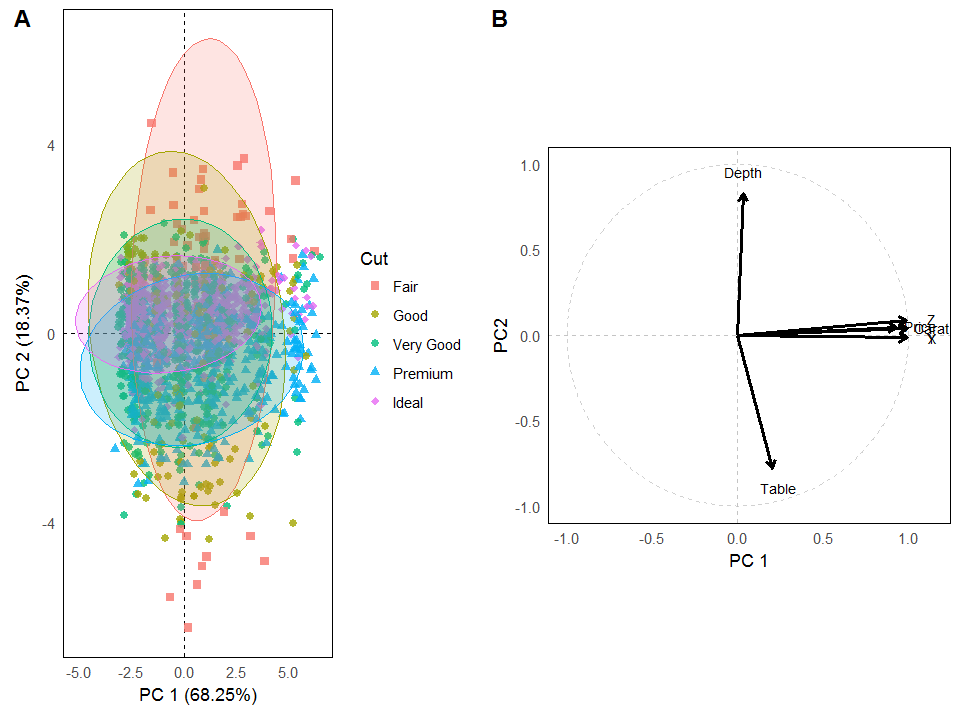
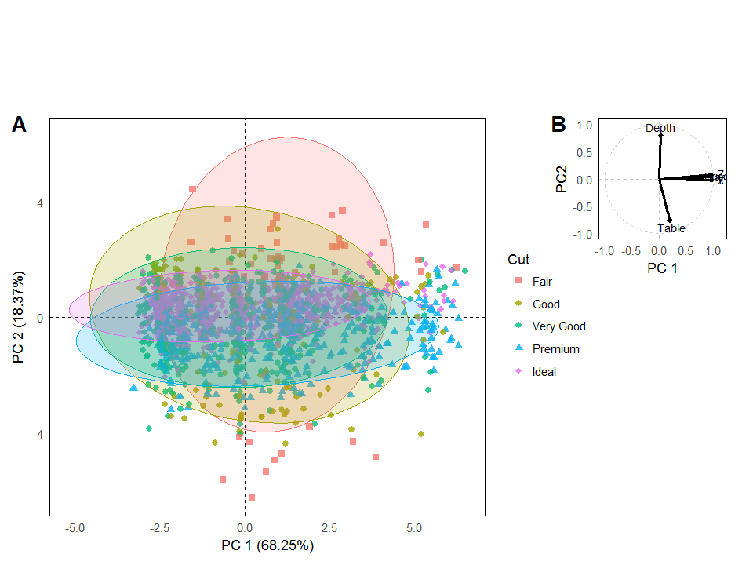

This is a tutorial on how to run a PCA using [FactoMineR](http://factominer.free.fr/ "FactoMineR"), and visualize the result using [ggplot2](https://ggplot2.tidyverse.org/ "ggplot2"). 


## Introduction

According to [Wikipedia](https://en.wikipedia.org/wiki/Principal_component_analysis "Wikipedia"), "Principal component analysis (PCA) is a statistical procedure that uses an orthogonal transformation to convert a set of observations of possibly correlated variables into a set of values of linearly uncorrelated variables called principal components."

PCA is a useful tool for exploring patterns in highly-dimensional data (data with lots of variables). It does this by constructing new variables, or principle components, that contain elements of all of the variables we start with, and can be used to identify which of our variables are best at capturing the variation in our data. 

In this post, I am not going to spend too much time talking about the details of running a PCA, and interpreting the results. Rather, I want to show you a simple way of making easily customizable PCA plots, using ggplot2.

Let's get started!

## Packages

First, we can load a few packages.


```r
require(FactoMineR)
require(factoextra)
require(ggplot2)
require(tidyr)
require(dplyr)
require(MASS)
require(reshape2)
require(cowplot)
```

## Setting up the data

The dataset I'll be using is the 'diamonds' dataset, which contains data on almost 54 000 diamonds. The variables are:

price = price in US dollars (\$326–\$18,823)

carat = weight of the diamond (0.2–5.01)

cut = quality of the cut (Fair, Good, Very Good, Premium, Ideal)

color = diamond colour, from J (worst) to D (best)

clarity = a measurement of how clear the diamond is (I1 (worst), SI2, SI1, VS2, VS1, VVS2, VVS1, IF (best))

x = length in mm (0–10.74)

y = width in mm (0–58.9)

z = depth in mm (0–31.8)

depth = total depth percentage = z / mean(x, y) = 2 * z / (x + y) (43–79)

table = width of top of diamond relative to widest point (43–95)


Let's load the data. 


```r

# load the data
data("diamonds")

# put data into a dataframe (rather than a tibble)
dat <- diamonds %>% data.frame

# check the data
head(dat)
##   carat       cut color clarity depth table price    x    y    z
## 1  0.23     Ideal     E     SI2  61.5    55   326 3.95 3.98 2.43
## 2  0.21   Premium     E     SI1  59.8    61   326 3.89 3.84 2.31
## 3  0.23      Good     E     VS1  56.9    65   327 4.05 4.07 2.31
## 4  0.29   Premium     I     VS2  62.4    58   334 4.20 4.23 2.63
## 5  0.31      Good     J     SI2  63.3    58   335 4.34 4.35 2.75
## 6  0.24 Very Good     J    VVS2  62.8    57   336 3.94 3.96 2.48
str(dat)
## 'data.frame':	53940 obs. of  10 variables:
##  $ carat  : num  0.23 0.21 0.23 0.29 0.31 0.24 0.24 0.26 0.22 0.23 ...
##  $ cut    : Ord.factor w/ 5 levels "Fair"<"Good"<..: 5 4 2 4 2 3 3 3 1 3 ...
##  $ color  : Ord.factor w/ 7 levels "D"<"E"<"F"<"G"<..: 2 2 2 6 7 7 6 5 2 5 ...
##  $ clarity: Ord.factor w/ 8 levels "I1"<"SI2"<"SI1"<..: 2 3 5 4 2 6 7 3 4 5 ...
##  $ depth  : num  61.5 59.8 56.9 62.4 63.3 62.8 62.3 61.9 65.1 59.4 ...
##  $ table  : num  55 61 65 58 58 57 57 55 61 61 ...
##  $ price  : int  326 326 327 334 335 336 336 337 337 338 ...
##  $ x      : num  3.95 3.89 4.05 4.2 4.34 3.94 3.95 4.07 3.87 4 ...
##  $ y      : num  3.98 3.84 4.07 4.23 4.35 3.96 3.98 4.11 3.78 4.05 ...
##  $ z      : num  2.43 2.31 2.31 2.63 2.75 2.48 2.47 2.53 2.49 2.39 ...
```


Because the dataset it fairly large, I am going to trim it down to a random subset. 


```r
dat <- dat[sample(rownames(dat), 2000),]
```


An often-overlooked issue is the need to scale the data before running a PCA. Because PCA attempts to maximize variance, if some variables have a large variance and some small, PCA will load more heavily on the large variances. Centering (subtracting the mean of a variable from each observation) and scaling (dividing each observation by the standard deviation of that variable) will deal with this.


```r

# remove rows with zeros in x, y, or z
dat <-  dat %>% filter (x > 0, y > 0, z > 0)

# log price

# center and scale the data
for (i in 1:length(colnames(dat))){
  
  if (is.numeric(dat[, i])==TRUE)
    
    dat[, i] <- as.numeric(scale(dat[, i]))
  
  else
    
    dat[, i] <- dat[, i]
  
}

head(dat)
##        carat       cut color clarity       depth      table      price
## 1 -0.7834181   Premium     E     VS2 -0.15268164  0.7282689 -0.7188793
## 2 -0.8256395   Premium     F    VVS2 -0.15268164  0.7282689 -0.7264568
## 3  0.1032313   Premium     D     SI2 -2.36804834  1.1879330 -0.1444583
## 4 -0.2134292 Very Good     F     VS1 -0.00975476  0.7282689 -0.2674089
## 5 -1.0156357     Ideal     G     SI1 -0.15268164 -0.1910594 -0.8254527
## 6 -0.9945250     Ideal     E     SI2  0.27609901 -1.5700518 -0.8706731
##            x           y           z
## 1 -0.8011785 -0.83601589 -0.83188890
## 2 -0.8458189 -0.90803229 -0.88947252
## 3  0.4398237  0.42427112  0.13263666
## 4 -0.0690765  0.01917887 -0.02571828
## 5 -1.1761576 -1.22310405 -1.20618241
## 6 -1.1583015 -1.15108765 -1.11980698
```

Now the mean and standard deviation of the numerical variables should be 0 and 1 respectively.

On to the PCA. 


## Running the PCA


```r
# Run the PCA
pca1 <- PCA(dat[ ,c("carat", "depth", "table", "price", "x", "y", "z", "clarity", "cut", "color")], 
        
            quali.sup = c(8:10), graph = FALSE)
```


We can plot the PCA, using 'plot.PCA'.


```r
plot.PCA(pca1)
```

<!-- -->


## Visualizing the PCA using ggplot2

Here's how we can do it with ggplot2. First, we extract the information we want from our 'pca1' object.


```r
# extract pc scores for first two component and add to dat dataframe
dat$pc1 <- pca1$ind$coord[, 1] # indexing the first column

dat$pc2 <- pca1$ind$coord[, 2]  # indexing the second column
```

We also need to extract the data for the variable contributions to each of the pc axes.


```r
pca.vars <- pca1$var$coord %>% data.frame

pca.vars$vars <- rownames(pca.vars)

pca.vars.m <- melt(pca.vars, id.vars = "vars")
```

By convention, the variable contribution plot has a circle around the variables that has a radius of 1. Here's some code to make one.


```r
circleFun <- function(center = c(0,0),diameter = 1, npoints = 100){
  r = diameter / 2
  tt <- seq(0,2*pi,length.out = npoints)
  xx <- center[1] + r * cos(tt)
  yy <- center[2] + r * sin(tt)
  return(data.frame(x = xx, y = yy))
}

circ <- circleFun(c(0,0),2,npoints = 500)
```

Now we can make our initial plot of the PCA.


```r
p <- ggplot(data = dat, aes(x = pc1, y = pc2)) +
  
  geom_point()
p
```

<!-- -->

And we can customize it a bit. For example, coloring and shaping the points by cut.


```r
p <- ggplot(data = dat, aes(x = pc1, y = pc2, color = cut, shape = cut)) +
  
      geom_hline(yintercept = 0, lty = 2) +
  
      geom_vline(xintercept = 0, lty = 2) +
  
      geom_point(alpha = 0.8) 
  

p
```

<!-- -->

We might want to change the shapes that ggplot2 is using by default, and also, for example, set the 'good' and 'very good' diamonds to have the same shape. 


```r
levels(dat$cut)
## [1] "Fair"      "Good"      "Very Good" "Premium"   "Ideal"
p <- ggplot(data = dat, aes(x = pc1, y = pc2, color = cut, shape = cut)) +
  
      geom_hline(yintercept = 0, lty = 2) +
  
      geom_vline(xintercept = 0, lty = 2) +
  
      guides(color = guide_legend(title = "Cut"), shape = guide_legend(title = "Cut")) +
  
      scale_shape_manual(values = c(15, 16, 16, 17, 18)) +
  
      geom_point(alpha = 0.8, size = 2) 
  

p
```

<!-- -->

Now the Cut categories 'good' and 'very good' have different colors, but are represented by the same shape.
We can also add confidence ellipse, make the theme look nicer, and fix the axis labels.


```r
p <- p + stat_ellipse(geom="polygon", aes(fill = cut), 
                 
                 alpha = 0.2, 
                 
                 show.legend = FALSE, 
                 
                 level = 0.95) +

     xlab("PC 1 (68.25%)") + 
  
     ylab("PC 2 (18.37%)") +
  
     theme_minimal() +
    
     theme(panel.grid = element_blank(), 
          
           panel.border = element_rect(fill= "transparent"))

p
```

<!-- -->

Now, for plotting the variable contributions, we can use the following code.


```r

vars.p <-  ggplot() +

               geom_path(data = circ,aes(x,y), lty = 2, color = "grey", alpha = 0.7) +
                
               geom_hline(yintercept = 0, lty = 2, color = "grey", alpha = 0.9) +
                
               geom_vline(xintercept = 0, lty = 2, color = "grey", alpha = 0.9) +

               geom_segment(data = pca.vars, aes(x = 0, xend = Dim.1, y = 0, yend = Dim.2),
                            
                            arrow = arrow(length = unit(0.025, "npc"), type = "open"), 
                         
                            lwd = 1) + 
  
              geom_text(data = pca.vars, 
                        
                        aes(x = Dim.1*1.15, y =  Dim.2*1.15, 
                            
                            label = c("Carat", "Depth", "Table", "Price", "X", "Y", "Z")), 
                        
                            check_overlap = F, size = 3) +
  
              xlab("PC 1") + 
  
              ylab("PC2") +
  
              coord_equal() +
              
              theme_minimal() +
              
              theme(panel.grid = element_blank(), 
              
                    panel.border = element_rect(fill= "transparent"))

vars.p
```

<!-- -->

And now let's put the PCA scatterplot and the variable contribution plots together using [cowplot](https://github.com/wilkelab/cowplot/blob/master/vignettes/introduction.Rmd "cowplot").


```r
plot_grid(p, vars.p, rel_heights = c(1, 1.3), 
          
          labels = c("A", "B"))
```

<!-- -->

A more flexible approach to combining plots would be to use the 'ggdraw' function. We can use this to embed the variable contribution plot into the scatterplot.


```r
ggdraw() +
  
  draw_plot(p , 0, 0.0, 0.8, 0.8) +
  
  draw_plot(vars.p, 0.7, 0.5, 0.3, 0.3) +
  
  draw_plot_label(label = "A", x = 0, y = 0.81) + 
  
  draw_plot_label(label = "B",  x = 0.72, y = 0.81) 
```

<!-- -->

The trickiest part is figuring out the positioning and the proportions of each plot. Of course, you also want to make sure you're not obscuring any data.


Thanks for reading!

~Tim


## Contact Me

Please check out my website at [timothyemoore.com](www.timothyemoore.com "timothyemoore.com")

